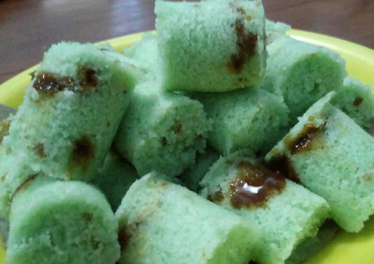

# ResepKue
<!DOCUMENT html>
<html>
<head>
	
Resep Pembuatan Makanan

	<link rel="stylesheet" type="text/css" href="style.css">
	</head>
<body background="bg1.jpg">
	<h1 style="text-align: center;" class="Judul">Odading</h1>
	
Odading adalah roti goreng dari Bandung berbentuk kotak menggelembung

	<h1 style="text-align: center;" class="judul">Asal-usul Odading</h1>
	
Odading sudah ada sejak masa kolonial Belanda. Dahulu ada kue goreng tak bernama yang terbuat dari adonan terigu campur gula. awal mula nama odading adalah orang belanda yang berkata "O,dat ding" yang artinya "O,benda itu". Terdengar lucu dan menarik dan akhirnya terlebar luaskan dengan disebut ODADING

	
</header>
	<nav class="Menu">
		<ul>
			<li>
				
<a href="Alat yang disiapkan.html">alat yang harus disiapkan</a>

			</li>
			<li>
				
<a href="cara pembuatan.html">cara pembuatan Odading</a>

			</li>
			</ul>
				

					
Di Posting Oleh <b>Ilham Nurfikri</b>

				

				
				
				<h1 style="text-align: center;"> Terima Kasih Sudah Berkunjung</h1>
				
 Dapatkan Resep lainya dengan cara klik
				<a href="Menu Selanjutnya.html">Selengkapnya →</a>
				

			

</body>
</html>
<!DOCUMENT html>
<html>
	<head>
		<title>alat yang harus disiapkan</title>
		<link rel="stylesheet" type="text/css" href="style.css">
	</head>
<body background="bg3.jpg">
	<h1 style="text-align: center;"> Alat yang harus disiapkan</h1>
		<h3 style="text-align: left;"> Bahan pembuatan odading</h3>
		
 1. Tepung terigu 500 gram

		
 2. Gula pasir 200 gram

		
 3. Telur ayam 2 butir

		
 4. Ragi instan 2 sendok makan

		
5. Garam 1/2 sendok teh

		
6. Air hangat 200 ml

		
7. Biji wijen putih

		
8. Minyak goreng

		<h3 style="text-align: center;"> Alat-alat yang digunakan</h3>
		
1. Wadah terbuka

		
2. Wadah tertutup

		
3. Wajan

		
4. Sendok

		
5. Saringan

		
6. Talenan

		

			<a href="ilhamnurfikri-4519210076-Tugas 3.html">kembali kemenu</a>
		

</body>
</html>
<!DOCUMENT html>
<html>
<head>
	<title>Cara pembuatan Odading</title>
	<link rel="stylesheet" type="text/css" href="style.css">
</head>
<body>
	<body background="bg3.jpg">
	<h1 style="text-align: center;">Cara pembuatan Odading</h1>
	
<b>1. Siapkan wadah dan masukkan tepung terigu, gula pasir, ragi instan, serta garam. Campurkan semuanya secara merata ya,

	
<b>2. Siapkan wadah lainya, pecahkan dan tuangkan telur. kemudian kocok telurnya. Tak usah lama-lama ya mengocok telornya,

	
<b>3. Sekarang masukkan campuran tepung di wadah pertama ke dalam wadah kedua yang berisi kocokan telur. Aduk semuanya hingga merata,
</b>
	
<b>4. Sekarang kita tuangkan air hangat ke dalam adonan sembari menguleni adonan dengan tangan hingga adonan tercampur merata dan elastis/kalis,
</b>
	
<b>5. Jika sudah, maka diamkan adonan resep Odading selama 30 menit dalam sebuah wadah tertutup hingga mengembang,
</b>
	
<b>6. Sesudah adonan sudah mengembang, maka bukalah wadah dan ambil sejumput adonan
</b>
	
<b>7. Bulatkan adonan satu per satu dan berikan taburan wijen putih di atasnya. Ulangi terus langkah ini sampai adonan habis.
</b>
	
<b>8. Waktunya untuk menggoreng adonan resep Odading. Siapkan wajan, letakkan di atas kompor, tuangkan minyak, dan panaskan.
</b>
	
<b>9. Jika minyak sudah terlihat panas, maka masukkan adonan resep Odading ke dalamnya dan goreng sampai warnya berubah jadi kuning kecokelatan alias matang.
</b>
	
<b>10. Jika sudah matang, maka angkat dan tiriskan Odading
</b>
	
<b>11. Akhirnya selesai sudah membuat resep Odading. Odading siap disajikan selagi hangat
</b>
		<a href="ilhamnurfikri-4519210076-Tugas 3.html">kembali kemenu</a>
	

</body>
</html>
